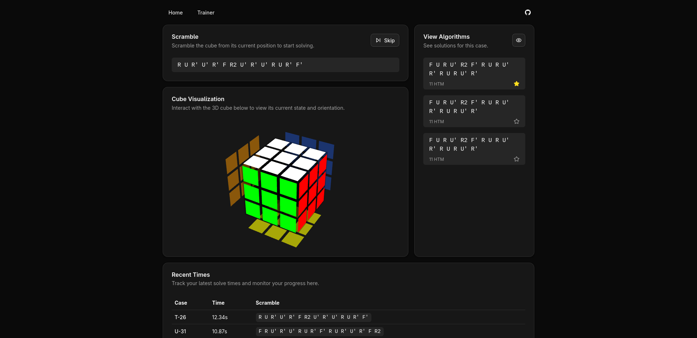

# ZBLL Trainer

[](https://www.gnu.org/licenses/gpl-3.0)

ZBLL algorithm trainer for speedcubing, with a focus on smart cube integration. The goal of this project is to help speedcubers learn ZBLL quickly, with the help of modern smart cube technology. Smart cubes are similar to the traditional 3x3 Rubik's cube, but they include modern hardware to track users' moves, and communicate that data over Bluetooth.



> [!NOTE]  
> This project is currently a work in progress. Features and functionality may change frequently, and some parts may be incomplete or unstable.

## Goals

* Instead of wasting time due to misscrambles, the trainer will always give you a sequence of moves to perform, from any position, that will put the cube in position for the next algorithm (rather than having to solve the cube and apply the scramble again).
* In lieu of having to maintain a separate list of algorithms, the trainer tracks which algorithms you use. If you forget an algorithm in practice, you will instantly find the algorithm you are learning.
* This project is local-first, meaning all core functionality will work without signing into an account.

## Usage

This project is deployed at [zbll.renntg.com](https://zbll.renntg.com/). Upon visiting the site, you may select any number of ZBLL cases on the home page.

Next, visit the [train tab](https://zbll.renntg.com/train). Connect your smart cube, using Bluetooth (may require manual input of the device's MAC address), and apply the scramble from the cube's current position. If you forget an algorithm, click "Reveal" on the algorithms panel, which will offer a selection of popular algorithms for the case. You can manually add an algorithm to your 'favorites,' or it will automatically be favorited when you use it in practice.

After solving the cube, you will be automatically given a new scramble to apply to your cube. If you wish to try the previous case again, press "Retry" next to the case, in the "Recent Times" section.

## Running Locally

To get this project running locally, on your own machine, install `pnpm`, and clone the repository.

```sh
pnpm install
pnpm run dev
```

## License

This project is licensed under the GNU General Public License v3.0 (GPLv3). For more information, see the [LICENSE](./LICENSE) file.